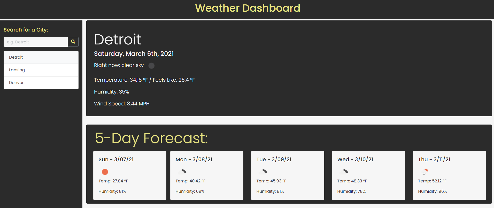

# Weather Application
## by Michael Bussert
### GitHub: [mbussert](https://github.com/mbussert) | Email: mbussert@gmail.com

## Links:
Deployed application: https://mbussert.github.io/weather-app/  
GitHub Repository: https://github.com/mbussert/weather-app 

## Description:
---------------------------------
I created a weather application using the OpenWeatherMap API. A user can enter the name of any city and the page will update with the current weather and 5 day forecast for the queried city. As a user searches, the search history is kept on the left-hand side of the page and if a user clicks on a city, the page will once again display the weather for that selected city.

----------------------------------------
### Multiple Searches

